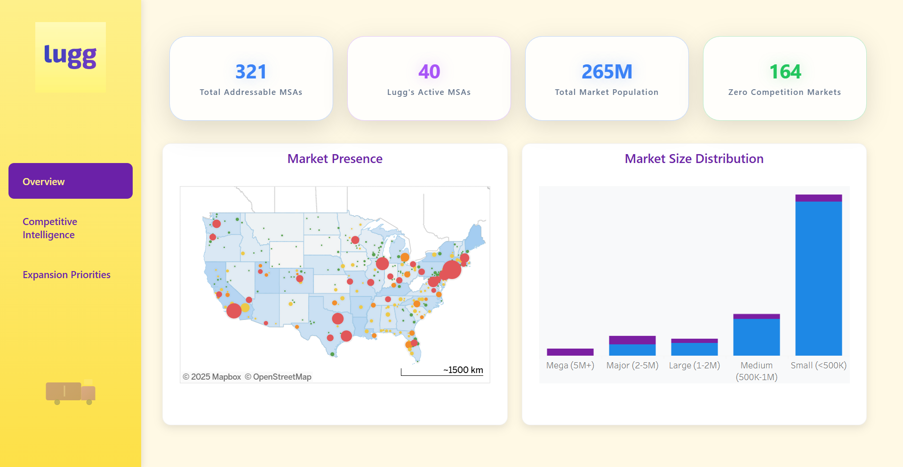

<h1 align="center"> Lugg Market Expansion Analysis</h1>

<p align="center">
  
</p>

<p align="center">
  
  
  
  
  
</p>

---

## Overview

A strategic market expansion analysis designed to help **Lugg** prioritize high-potential metropolitan areas across the U.S. using data-driven insights. The project integrates competitive analysis, demographic profiling, and a multi-factor scoring algorithm to optimize expansion decisions.


🎥 **[Watch Demo Video (1 min)](https://drive.google.com/file/d/1vf7u3VIbbswkIVTHFkTCqZjW8F8B0xRj/view?usp=sharing)**

---

## Key Outcomes

- Identified **164** untapped metro areas with zero competition
- Estimated **$1.48M** annual revenue potential from top 3 targets
- Achieved **97.5%** location matching with Census MSA definitions
- Benchmarked against competitors (GoShare, TaskRabbit, Dolly)

---

## Technical Approach

### Data Engineering

- Aggregated competitor data from 892 cities across 4 platforms
- Standardized and mapped to 321 U.S. Metropolitan Statistical Areas
- Enriched with Census Bureau demographic data (population, income)
- Achieved >97% match accuracy using CBSA & OMB MSA codes

### Analytical Framework

#### Expansion Scoring Logic

```python
Market Attractiveness = (Population Percentile × 0.5) + 
                        (Income Percentile × 0.3) + 
                        (Market Size Bonus × 0.2)

Expansion Score = (Market Attractiveness × 0.6) + 
                  (Competition Opportunity × 0.4)
```

#### Revenue Estimation

- Formula: `Population × 0.001 × $50 × 12`
- Assumptions:
  - $50 average order value
  - 0.1% market penetration
  - 12 orders per year per customer

---

## Dashboard Highlights

- **Overview**: KPI cards, market presence maps, population trends
- **Competitive Intelligence**: Market share analysis, heatmap matrix
- **Expansion Priorities**: Top cities ranked by score & revenue potential

---

## Top 5 Market Opportunities

| Metro Area             | Population | Median Income | Score | Est. Revenue |
|------------------------|------------|---------------|-------|---------------|
| Poughkeepsie, NY       | 697K       | $93K          | 83.2  | $419K         |
| Grand Rapids, MI       | 1.1M       | $77K          | 82.9  | $652K         |
| Madison, WI            | 679K       | $83K          | 80.6  | $407K         |
| Riverside, CA          | 4.6M       | $81K          | 80.6  | $2.8M         |
| Portland, ME           | 553K       | $84K          | 79.4  | $332K         |

---

## Technical Stack

- **Languages**: Python, HTML, CSS, JavaScript
- **Libraries**: Pandas, NumPy
- **Visualization**: Tableau Public (embedded), CSS Grid & Flexbox
- **Platform**: Google Colab, GitHub
- **Data**: U.S. Census Bureau, Competitor Websites

---

## Setup Instructions

### Requirements

- Python 3.7+
- Chrome or Edge browser (for dashboard compatibility)

### Launch Dashboard

```bash
# Clone repository
git clone https://github.com/priyankaraghunathan15/lugg-market-expansion-analysis.git
cd lugg-market-expansion-analysis

# Open the dashboard
open index.html  # macOS
start index.html # Windows
```

---

## 📂 Repository Structure

```
lugg-market-expansion-analysis/
├── index.html                             # Dashboard
├── styles.css                             # Styling and animations
├── Lugg_Market_Expansion_Analysis.ipynb   # Market analysis notebook
├── images/
│   ├── lugg-image.jpeg                    # Project image for README 
│   ├── lugg-logo.jpeg                     # Lugg branding
├── data/
│   ├── census_metro_data.csv
│   ├── lugg_strategic_market_analysis.csv
│   ├── lugg_top_15_expansion_opportunities.csv
│   └── lugg_executive_summary.csv
└── README.md                              # Project documentation
```

---

## Future Enhancements

- Real-time competitor tracking with APIs
- Predictive modeling for market demand
- Integration of age and education demographics
- Tableau Server deployment for dynamic updates


